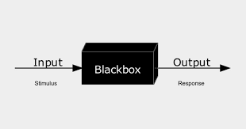

# Stunde 2

## Was ist Informatik (**C**omputer **S**cience)?

* *Duden Informatik*

    > Informatik ist die „Wissenschaft von der systematischen Darstellung, Speicherung, Verarbeitung und Übertragung von Informationen, besonders der automatischen Verarbeitung mithilfe von Digitalrechnern“.

* Informatik beschäftigt sich im Wesentlich nur mit Problemlösen, Programmieren - alleine oder im Team - ist ein mögliches Hilfsmittel dabei.

* Kooperation ist ein wichtiger Aspekt beim Problemlösen. Diese kann verschiedene Formen annehmen, wie z.B. Gespräche, Beratungen. Dies kann dabei helfen, verschiedene Perspektiven zu sehen und Voreingenommenheiten bei der Entwicklung von Problemlösungen zu vermeiden.

* Wir können uns Problemlösen als Prozeß vorstellen, bei dem man bestimmte Eingaben annimmt (die unser Problem beschreiben) und daraus eine Ausgabe generiert (die Lösung des Problems). 

    

    Der schwarze Kasten, ist der Teil, über den man in verschiedenen Kontexten im Informatikunterricht spricht.

* Wir müssen einen Weg finden für verschiedene Probleme die Eingaben und Ausgaben darzustellen.