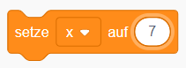
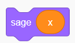
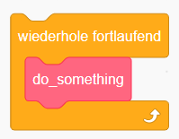
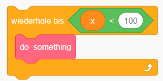
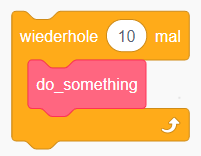
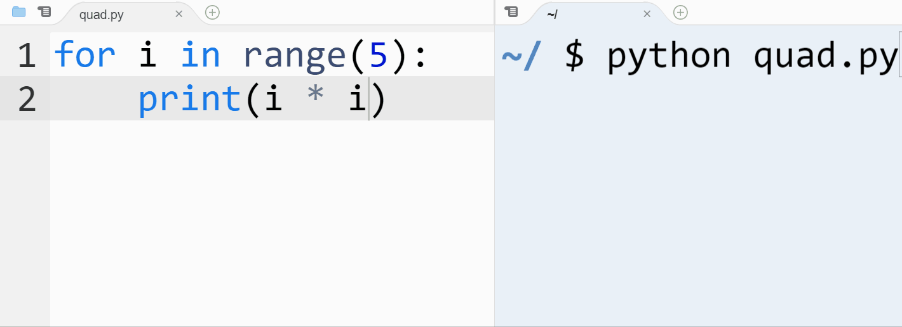
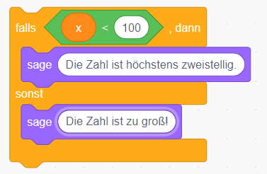
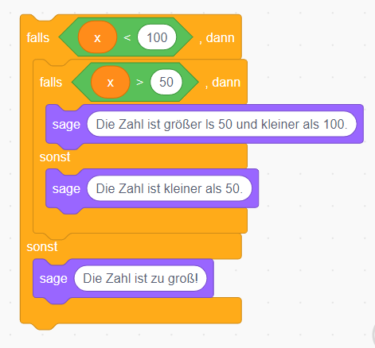

# Srcatch vs. Python

Die grafische Programmierumgebung von Scratch, arbeitet mit Blöcken, die die Programmanweisungen enthalten. Für größere Programmierprobleme ist es aber einfacher - beim Programmieren - mit einer textuellen Eingabe zu arbeiten. Im Folgenden vergleichen wir unterschiedliche Blöcke von Scratch mit der Syntax von Python.

## Variablen zuweisen (*assignment*)



```python
x = 7
```

**Beachte:** Das Symbol `=` steht nicht für die Gleichheit, sondern muss gelesen werden als "der Wert rechts von diesem Zeichen, wird unter dem Namen links vom Zeichen gespeichert.

## Ausgabe (*print*)



```python
print(x)
```

## Wiederholungen (*loops*)



```python
while True:
    do_something()
```



```python
while x < 100:
    do_something()
```

Der grüne Kasten beschreibt in Scratch eine Bedingung, die erfüllt sein kann (`True`) oder nicht erfüllt sein kann (`False`). Der innere Teil der Wiederholung bzw. Schleife, wird solange ausgeführt, wie die Bedingung noch erfüllt ist. In Python wird der innere Teil durch eine Einrückung um 4 Leerzeichen (bzw. 1 Tab) kenntlich gemacht.



```python
for i in range(10):
    do_something()
```

Die eingebaute Funktion `range` liefert so die zehn Zahlen `0, 1, 2, ..., 9` zurück. Für jeder dieser zehn Zahlen wird `do_something` aufgerufen, also insgesamt 10-mal. Python hat den Vorteil, dass man auch diese Zahlen unter der Variablen `i` ansprechen kann, vergleiche das folgende Bild, welches zeigt, wie man Quadratzahlen ausgeben lassen kann.



## Fallunterscheidung (*if - else*)



```python
if x < 100:
    print('Die Zahl ist höchsten zweistellig.')
else:
    print('Die Zahl ist zu groß!')
```

Hier ein komplexeres Beispiel, bei dem die Nachteile der grafischen Oberfläche deutlich werden.



```python
if x < 50:
    print('Die Zahl ist kleiner als 50.')
elif x < 100:
    print('Die Zahl ist größer als 50 und kleiner als 100.')
else:
    print('Die Zahl ist zu groß!')
```

In Python kann man theoretisch beliebig viele Fälle unterscheiden, in dem man entsprechend viele `elif`-Fälle hinzufügt. Dabei steht `elif` für `else if`, was in anderen Programmiersprachen, den ineinandergeschachtelten `if-else`-Fälle aus dem Scratchbeispiel entspricht.

```python
if x == 0:
    ...
elif x == 1:
    ...
elif x == 2:
    ...

...

elif x == 10:
    ...
else:
    ...
```

Übrigens, da das einfache `=` als Zuweisung verstanden wird, wird das doppelte `==` für Bedingungen, die die Gleichheit überprüfen verwendet.