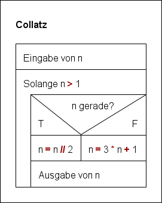
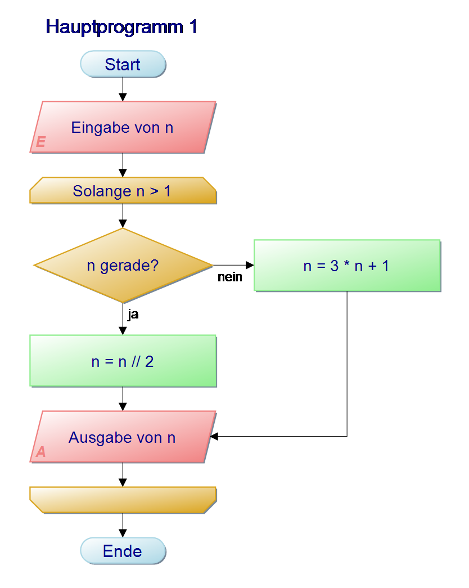
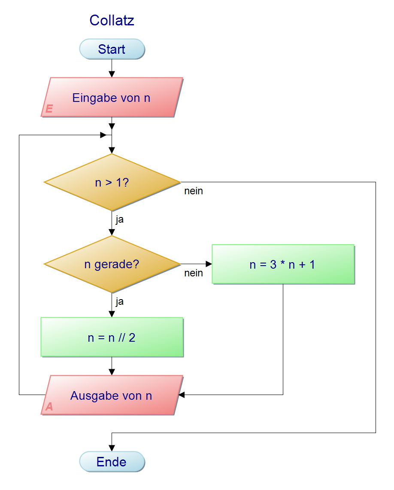

# Lösungen zur Hausaufgabe

## Collatzfolge als Pythoncode

```python
n = 1017

while n > 1:
    if n % 2 == 0:
        n = n // 2
    else:
        n = 3 * n + 1
    print(n)
```

## Collatzfolge im Programmablaufplan

(Erstellt mit dem [Structorizer](https://structorizer.fisch.lu/))



## Collatzfolge im Programmablaufplan

(Erstellt mit dem [PAPDesigner](https://www.heise.de/download/product/papdesigner-51889))



Alternativ, ohne Verwendung der speziellen Schleifendarstellung:



