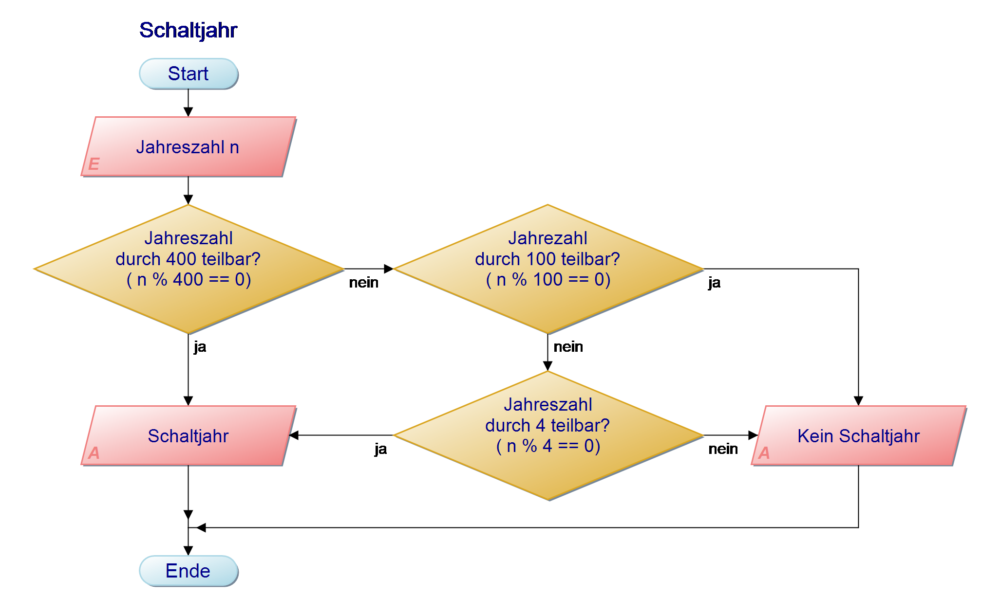
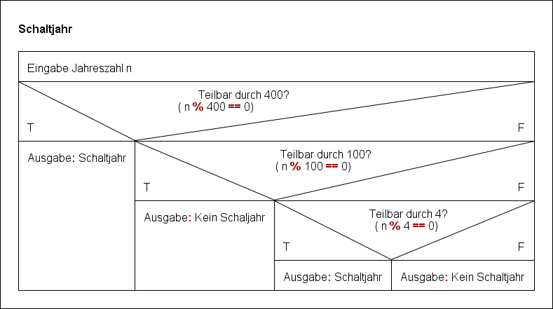

# Schaltjahre

## Programmablaufplan



## Struktogramm




## Python-Quellcode

```python
i = input("Eingabe einer Jahrezahl: ")
n = int(i) # Text der Ziffern in Zahl umwandeln

if n % 400 == 0:
    print("Schaltjahr")
else:
    if n % 100 == 0:
        print>("Kein Schaltjahr")
    else:
        if n % 4 == 0:
            print("Schaltjahr")
        else:
            print("kein Schaltjahr")
```
