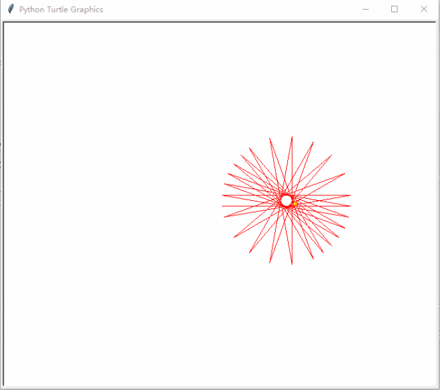

# Turtle-Grafiken



[Turtle-Grafiken](https://de.wikipedia.org/wiki/Turtle-Grafik) wurden z.B. in der pädgogischen Programmiersprache [LOGO](https://de.wikipedia.org/wiki/Logo_(Programmiersprache)) genutzt, damit Programmieranfänger durch die grafische Ausgabe ein schnelles Feedback zu ihrem Code erhalten konnten.

Auch die Programmiersprache Python bietet eine entsprechende Version der Turtle-Grafiken in dem Modul [turtle](https://docs.python.org/3.6/library/turtle.html) an.

Die Grundidee besteht darin, dass man eine Schildkröte, welche eine farbige Spur beim bewegen zeichnet, durch Befehle auf dem Zeichenblatt steuert.

Die Grundbefehle heißen:
 - `forward (fd)`
 - `left (lt)`
 - `right (rt)`

Ein Beispiel Programm könnte wie folgt aussehen:

```python
import turtle

t = turtle.Turtle()

t.forward(100)
t.left(90)
t.forward(200)

turtle.exitonclick()

```