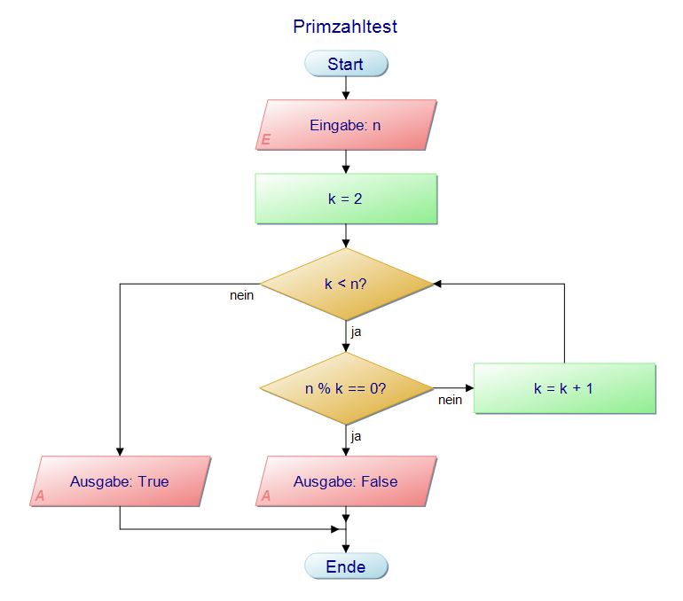
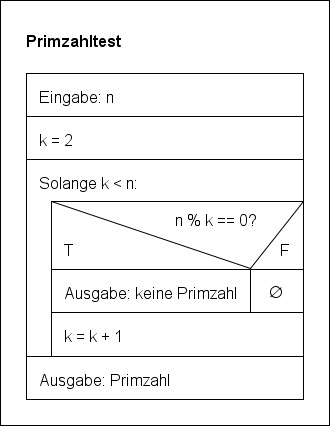

# Primzahlen

## Definition Primzahl 
Die Definition einer Primzahl ist für uns:
> Eine Zahl ist eine Primzahl, wenn die Teilermenge **genau** zwei Teiler enthält.

Die Teilermenge von 7 ist T_7 = {1, 7}, daher ist 7 eine Primzahl.

Die Teilermenge von 4 ist T_4={1, 2, 4}, daher ist 4 keine Primzahl.

## Primzahltest

Man muss um eine Zahl als Primzahl zu identifizieren, die Teilermenge bestimmen. Sobald man sicher weiß, dass es mindestens einen dritten Teiler gibt, kann man direkt entscheiden, dass die Zahl keine Primzahl ist.

Zur Übersicht stellen wir den Vorgang in einer Tabelle dar:

Für die Zahl 7:

| Zahl | 1 | 2 | 3 | 4 | 5 | 6 | 7 |
|---|---|---|---|---|---|---|---|
| Teilt? | Ja | Nein | Nein | Nein | Nein | Nein | Ja |

Für die Zahl 6:
| Zahl | 1 | 2 | 3 | 4 | 5 | 6 |
|---|---|---|---|---|---|---|
| Teilt? | Ja | Ja | Ja | Nein | Nein | Ja |

## Darstellungen des Algorithmus

1. Pseudocode

    ```
    Für jede Zahl k von 2 bis n-1:
        Wenn n durch k teilbar ist:
            Ausgabe: keine Primzahl
    Wenn alle Zahlen überprüft wurden ohne Teiler zu finden:      
        Ausgabe: Primzahl
    ```

2. Programmablaufplan

    

3. Struktogramm
    

## Umwandeln in Pythoncode

Wir benutzen in diesem ersten Beispiel eine **Funktion**. Da Funktionen eine Rückgabewert haben, ist es möglich z.B. die Ausführung der Schleife direkt zu unterbrechen, sobald man bemerkt hat, dass es sich sicher nicht um eine Primzahl handelt.

```python
def is_prime(n):
    k = 2
    while k < n:
        if n % k == 0:
            return False
        k = k + 1
    return True
```

Durch eine Aufruf wie `is_prime(7)` kann man dann den Primzahltest für 7 durchführen. Je nachdem, wo man die Funktion ausführt, ist es notwendig ggf. noch den Rückgabewert auszugeben, d.h. `print(is_prime(7))`. In einer REPL-Sitzung (Read-**Print**-Eval-Loop), wird ja automatisch das Ergebnis ausgegeben.

Wie das Programm abläuft kann man mit Hilfe des [Python-Tutors](http://www.pythontutor.com/visualize.html#mode=edit) ansehen.

[Primzahltest bei Python-Tutor](http://www.pythontutor.com/visualize.html#code=def%20is_prime%28n%29%3A%0A%20%20%20%20k%20%3D%202%0A%20%20%20%20while%20k%20%3C%20n%3A%0A%20%20%20%20%20%20%20%20if%20n%20%25%20k%20%3D%3D%200%3A%0A%20%20%20%20%20%20%20%20%20%20%20%20return%20False%0A%20%20%20%20%20%20%20%20k%20%3D%20k%20%2B%201%0A%20%20%20%20return%20True%0A%20%20%20%20%0Aprint%28is_prime%281007%29%29&cumulative=false&curInstr=0&heapPrimitives=nevernest&mode=display&origin=opt-frontend.js&py=3&rawInputLstJSON=%5B%5D&textReferences=false)


