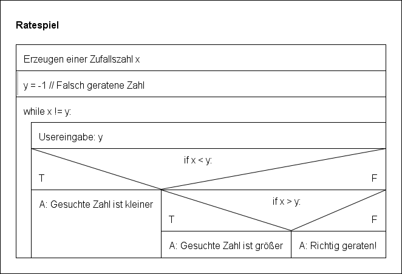

# Das Ratespiel

## Spielablauf

Jemand denkt sich eine Zahl zwischen 0 und 100. Der andere rät diese Zahl. Als Information erhält er nach jemand Versuch die Information, ob er richtig geraten hat oder die Zahl zu groß oder zu klein ist.

> P: Ich habe mir eine Zahl zwischen 0 und 100 ausgedacht.  
Q: 60?  
P: Zu groß geraten.  
Q: 30?  
P: Zu groß geraten.  
Q: 15?  
P: Zu klein geraten.  
...

## Erstellen eines Struktorgramms

Das Programm enthält eine Schleife, da mehrer Durchgänge notwendig sind, bis die Zahl gefunden wurde. Außerdem ist auch eine Fallunterscheidung notwendig, da je nach geratene Zahl ausgegeben werden muss, ob die gesuchte Zahl größer oder kleiner ist.



## Übersetzen in ein Python-Programm

Zufallszahlen kann man mit dem Modul `random` erzeugen. Dafür benutzen wir die Zeile 

```python
from random import randint
```

Damit wird die Funktion `randint` bereitgestellt, die uns Zufallszahlen erzeugt.

Der Aufruf `randint(10, 20)` würde zufällig eine Zahl x ausgeben mit 10 <= x <= 20.

Außerdem müssen wir Usereingaben annehmen, damit wir die geratenen Zahl abfragen können. Dazu benutzen wir die `input`-Funktion.
Die Verwendung ist z.B.

```python
name = input("Wie ist Dein Name? ")
```

Der User würde die Frage "wie ist Dein Name?" sehen und könnte dann etwas eingeben und mit Enter an das Pythonprogramm senden. Dabei wird aber die Usereingabe als String übergeben. Insbesondere bei unsere geratene Zahl ist dies unpraktisch, daher wandeln wir diese mit der `int`-Funktion in eine ganze Zahl (*integer*) um.

```python
>>> x = "1023"
>>> x * 2
"10231023"
>>> y = int("1023")
>>> y * 2
2046
```

Insgesamt erhalten wir das folgenden Programm:

```python
from random import randint

def guessing_game():
    x = randint(1, 99)
    print("Ich denke an eine Zahl zwischen 0 und 100.")
    print("Rate diese Zahl mit möglichst wenigen Versuchen.")
    y = -1
    while x != y:
        y_str = input("Geratene Zahl: ")
        y = int(y_str)
        if x < y:
            print("Die gesuchte Zahl ist kleiner.")
        elif x > y:
            print("Die gesuchte Zahl ist größer.")
        else:
            print(f"Richtig geraten. Die gesuchte Zahl war {y}.")
```

In der letzen Zeile benutzen wir einen sogenannten *formattierten String*, der durch das vorangestellte `f` gekennzeichnet wird. Der Teil `{y}` wird im formattierten String dann durch den Wert der Variablen `y` ersetzt.