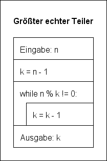
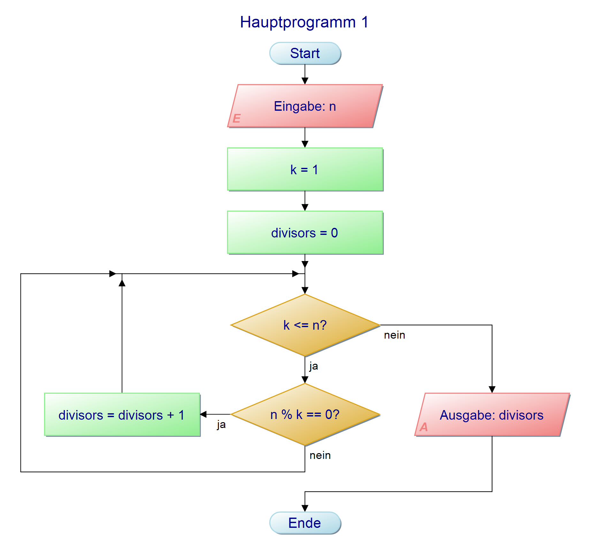

# Übungen für die Kursarbeit

[Link zur Hausaufgabe](https://classroom.github.com/a/2EGiwXho)

## Die Lösungen bitte erst später ansehen bzw. bei großer Verzweiflung

### Aufgabe 1: Umwandlung von Visualisierungen beim Programmentwurf

Wir kennen Pseudocode, Struktogramme und Programmablaufpläne um Programme zu entwerfen. Du erhälst drei Programme in jeweils einer der drei Formen. Wandle jedes Programm auch in die beiden fehlenden Varianten um!

a) Struktogramm



b) Programmablaufplan



c) Pseudocode

Überprüfen ob eine Zahl eine Quadratzahl ist:

```
- Eingabe der zu untersuchenden Zahl:n
- Festlegen von k = 0.
- Solange k * k < n erhöhe k um 1.
- Wenn k * k = n ist, dann ist es eine Quadratzahl, sonst nicht.
```

### Aufgabe 2: Tracing-Tabelle

Lege für jedes der drei Programme eine Tabelle an, die alle Werte der Variablen angibt. Gehe davon aus, dass jedem Programm die Zahl 12 übergeben wird. 

Z.B. für (a) die Tabelle
| n | k |
|:--:|:--:|
| 12 | 11 |
|...|...|

### Aufgabe 3: Übersetze jede der drei Funktionen in ein lauffähiges Python-Programm