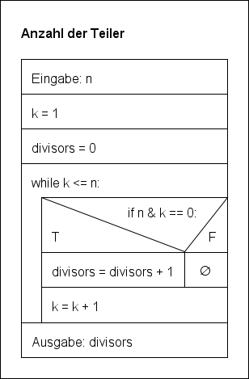
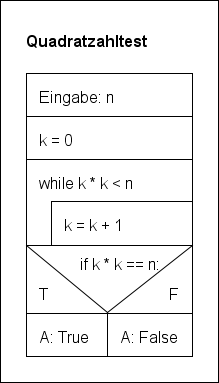

# Lösungen zu den Übungen


### Aufgabe 1:

* größter Teiler 

    

    ```
    - Eingabe der Zahl n.
    - Variable k = n - 1.
    - Solange k nicht n teilt, vermindere k um 1.
    - Ausgabe von k.
    ```


* Anzahl der Teiler 

    

    ```
    - Eingabe der Zahl n.
    - Variablen k = 1 und divisors = 0.
    - Solange k nicht größer als n ist,
    - Wenn n durch k teilbar ist, erhöhe divisors um 1,
    - Erhöhe k um 1.
    ```

* Quadratzahltest   

    

    

### Aufgabe 2:

* größter echter Teiler  

    | n | k |
    |:--:|:--:|
    | 12 | 11 |
    | 12 | 10 |
    | 12 | 9 |
    | 12 | 8 |
    | 12 | 7 |
    | 12 | 6 |


* Anzahl der Teiler 

    | n | k | divisors |
    |:--:|:--:|:--:|
    | 12 | 1 | 1 |
    | 12 | 2 | 2 |
    | 12 | 3 | 3 |
    | 12 | 4 | 4 |
    | 12 | 5 | 4 |
    | 12 | 6 | 5 |
    | 12 | 7 | 5 |
    | 12 | 8 | 5 |
    | 12 | 9 | 5 |
    | 12  | 10 | 5 |
    | 12 | 11 | 5 |
    | 12 | 12 | 6 |

* Quadratzahltest   

    | n | k |
    |:--:|:--:|
    | 12 | 0 |
    | 12 | 1 |
    | 12 | 2 |
    | 12 | 3 |
    | 12 | 4 |

### Aufgabe 3:

* größter echter Teiler  
    ```python
    def greatest_divisor(n):
        k = n - 1
        while n % k != 0:
            k = k - 1
        
        return k
    ```

* Anzahl der Teiler  
    ```python
    def count_divisors(n):
        k = 1
        divisors = 0
        while k <= n:
            if n % k == 0:
                divisors = divisors + 1
            k = k + 1
        
        return divisors
        
        return k
    ```

* Quadratzahltest
    ```python
    def is_square(n):
        k = 0
        while k * k < n:
            k = k + 1
        
        return k * k == n
    ```