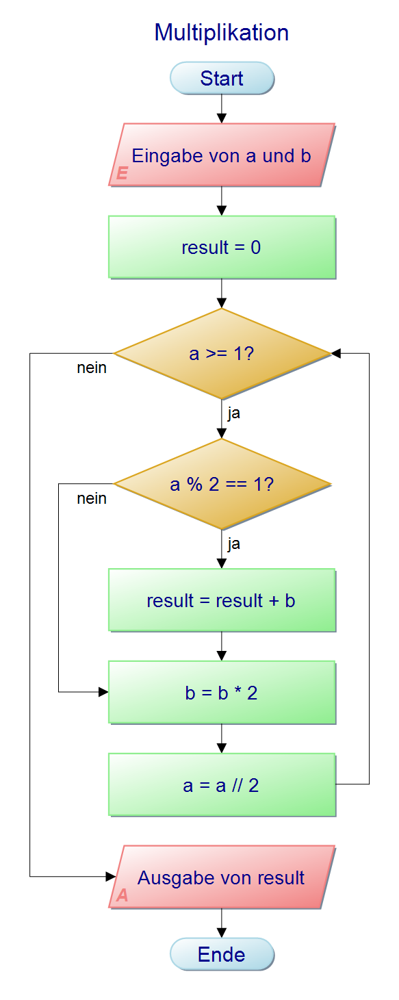
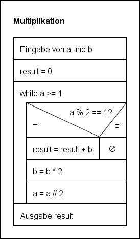

# Aufgabe 1

a)  
    Multiplikation von 16 und 7:

| Multiplikator | ungerade | Multiplikand | Ergebnis |
|:----:|:----:|:----:|:----:|
| 16 |  nein | 7 | 0 |
| 8 | nein  | 14   | 0 |
| 4 | nein |  28  | 0  |
| 2 | nein |  56  | 0 |
| 1 | nein |  112  |112 |


Multiplikation von 123 und 10:

| Multiplikator | ungerade? | Multiplikand | Ergebnis |
|:---:|:---:|:---:|:---:|
|   123  |  ja    | 10   | 10     |
| 61    | ja     | 20   | 30   |
|   30  |  nein    |  40  |  30 |
|   15 |   ja   |  80  |  120   |
|   7  |   ja   |  160  | 280  |
| 3 | ja | 320 | 600 |
| 1 | ja | 640 | 1240 |

b) 
    

c)
    

d)
    ```python
    def multiplication(a, b):
        result = 0
        while a >= 1:
            if a % 2 == 1:
                result = result + b
            a = a // 2
            b = b * 2
        return result
    ```