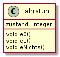

# Musterlösung Kursarbeit


## 1. Aufgabe
### Wolf-Ziege-Kohl-Problem

a) 
> Listen Sie alle 16 möglichen Zustände auf und geben Sie für jeden Zustand an, ob er nach Aufgabenstellung erlaubt ist.

| Nr. | B | W | Z | K | Name | Erlaubt? |
|---:|:---:|:---:|:---:|:---:|:---| :--|
 1| 0 | 0| 0 | 0 | BWZK/- | ja |
 2| 0 | 0 | 0 | 1 | BWZ/K | ja |
|3| 0 | 0 | 1 | 0 | BWK/Z | ja |
|4| 0 | 0 | 1 | 1 | BW/ZK | nein |
|5| 0 | 1 | 0 | 0 | BZK/W | ja |
|6| 0 | 1 | 0 | 1 | BZ/WK | ja |
|7| 0 | 1 | 1 | 0 | BK/WZ | nein |
|8| 0 | 1 | 1 | 1 | B/WZK | nein |
|9| 1 | 0 | 0 | 0 | WZK/B | nein |
|10| 1 | 0 | 0 | 1 | WZ/BK| nein |
|11| 1 | 0 | 1 | 0 | WK/BZ | ja |
|12| 1 | 0 | 1 | 1 | W/BZK | ja |
|13| 1 | 1 | 0 | 0 | ZK/BW | nein |
|14| 1 | 1 | 0 | 1 | K/BWZ | ja |
|15| 1 | 1 | 1 | 0 | K/BWZ | ja |
|16| 1 | 1| 1 | 1 | -/BWZK | ja |

b)
> Erstellen Sie ein Zustandsdiagramm für das Problem, bei dem nur erlaubte Zustände verwendet werden. Ergänzen Sie zwischen den Zuständen die erlaubten Übergänge und markieren Sie diese mit kleinen Buchstaben.


c)
> Geben Sie die Liste der Bootsfahrten an, die der Bauer unternehmen kann, um mit möglichst wenig Überfahrten die Aufgabe zu bewältigen.

* 1. Möglichkeit:
    ```bz, b, bw, bz, bk, b, bz```

* 2. Möglichkeit:
    ```bz, b, bk, bz, bw, b, bz```

d) 
 Bei zwei möglichen Mitfahrern kann man entweder durch ```bwk, b, bz``` bzw. durch ```bz, b, bwk``` die Aufgabe lösen.

 ## 2. Aufgabe
 ### Fahrstuhl

 a) 
 > Erstelle ein Klassendiagramm.

 

 b) 
 > Beschreiben Sie alle Methoden, die `e0`, `e1` und `eNichts` zugeordent sind, in der Programmiersprache Python in Ihrem Heft.

 ```python
 def e0(self):
    if self.state == 1:
        self.state = 0
    elif self.state == 3:
        self.state = 5
    elif self.state == 4:
        self.state = 5

 def e1(self):
    if self.state == 0:
        self.state = 2
    elif self.state == 1:
        self.state = 2
    elif self.state == 4:
        self.state = 3

 def eNichts(self):
    if self.state == 0:
        self.state = 1
    elif self.state == 2:
        self.state = 3
    elif self.state == 3:
        self.state = 4
    elif self.state == 5:
        self.state = 0
 ```

 c)

 > Geben Sie eine Variante von `e1` an, bei der diese Zusatzinformation aus `blockiert` genutzt wird.

 Nur beim Wechsel von `z0` zu `z2` wird eine geöffnete Türe, die möglicherweise blockiert ist, geschlossen. Daher muss auch nur dort die zusätzliche Abfrage erfolgen.

  ```python
 def e1(self):
    if self.state == 0 and self.blockiert == False:
        self.state = 2
    elif self.state == 1:
        self.state = 2
    elif self.state == 4:
        self.state = 3
 ```