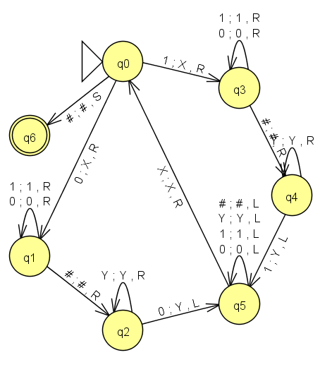
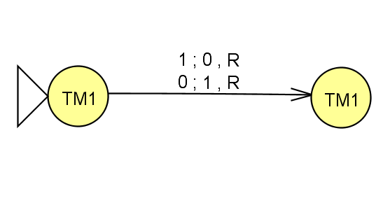
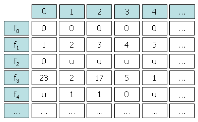
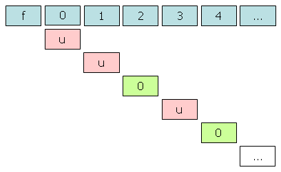
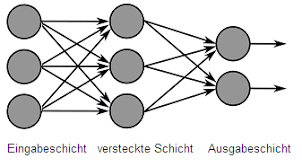

# Kursarbeit 13

## 1. Aufgabe
### a)

*Erläutern Sie, was man unter einer Turingmaschine versteht.*

- beweglicher Lese-/Schreibkopf
- unendliches Band (evtl. mehrdimensional)
- die Eingabe wird auf das Band im Eingabealphabet notiert, bei der Verabreitung schreibt die Turingmaschine ggf. auch noch Hilfssysmbole aus dem Arbeitsalphabet auf das Band
- die Turingmaschine befindet sich immer in einem von endlich vielen Zuständen
- in jedem Verarbeitungsschritt wird ein Bandsymbol gelesen, ein Bandsymbol geschrieben und der Lesekopf bewegt. Dazu ist es möglich, dass dann auch Zustandswechsel auftauchen. `z0 0 0 R; z0 1 0 L; z1 0 1 L; z1 1 1 R; zS;`

### b)

*Skizzieren Sie das Zustandsdiagramm einer Turingmaschine, welche zwei durch `#` getrennte Binärzahlen akzeptiert, wenn diese übereinstimmen.*

### c)

*Gesucht ist eine Turingmaschine, welche Binärzahlen, welche sich in höchstens einem Bit unterscheiden akzeptiert.*

Idee: Vergleiche ersteinmal mit TM1, ob es einen Unterschied gibt, falls ja, korrierge diesen durch tauschen von einer 1 und 0. Wenn danach TM1 akzeptiert, war tatsächich höchstens ein Bit unterschiedlich.

## 2. Aufgabe
### a)

Ein Problem ist berechenbar, wenn es es einen Algorithmus gibt, der in endlich vielen Schritten die Lösung des Problems generiert.

### b)
Nach dem Satz von Church-Turing sind alle Berechnungsmodelle gleichmächtig, d.h. ein Problem ist berechenbar, falls es z.B. turingmaschinenberechenbar ist, falls es Python-berechenbar ist, ...

### c)
Wenn man ein feste Bandalphabet hat, z.B.  mit nur `B` (Leerzeichen) und `I` als Bandsymbol (unitäre Kodierung), kann  man alle Turningmaschinen mit fester Zustandsanzahl lexikographisch sortieren, d.h. für einen Zustand (und den Stopzustand) ist die Liste

`z0 B B L z0; z0 I B L z0;`

`z0 B B L z0; z0 I B L zS;`

`z0 B B L z0; z0 I B R z0;`

`...`

`z0 B I R zS; z0 I I R zS;`

endlich lang und eindeutig geordnet. Damit kann man für jede Turingmaschine eindeutig entscheiden, wo sie in einer solchen Liste, die auch Turingmaschinen mit mehre Zuständen enthält vorkommt.

### d)
**Widerspruchsbeweis durch Diagonalisierungsverfahren**

Angenommen es gäbe doch nur abzählbar unendlich viele partielle Funktionen, d.h. man könnte diese durch natürliche Zahlen nummerieren. Da es auch nur abzählbarunendlich viele Eingaben gibt (`I, II, III, ...`) kann man diese dann in einem Rechteck anordnen.

Man konstruiert eine neue Funktion durch die Diagonale.

Die Funktion die wir so definiert haben, stimmt mit keine unsere Funktionen überein, da sie sich mindestens auf der Diagonalen von allen anderen Funktionen unterscheidet. Damit kann die Liste, die aber alle Funktionen enthalten sollte, nicht existieren und es gibt mehr als abzählbarunendlich viele partielle Funktionen.

### e)
Da es mehr partielle Funktionen/Probleme als Turingmaschinen gibt, muss es Probleme geben, die eine Turingmaschine nicht lösen kann.

Als Beispiele haben wir das Halteproblem und die Rado-Funktion kennengelernt.

### f)

Das Spielfeld ist `n * n` Felder groß und es gibt sechs unterschiedliche Symbole, die in jedes Feld eingetragen werden können. Daher ist die Anzahl der Versuche beim Lösen durch Ausprobieren durch ca. 6^(n*n) gegeben.

### g) + h)

| n | O(n) | Laufzeit (in a) |
|:---:|:----:|:----:|
| 5  | 2,8e19 | 243 |
| 7 | 1,0e28 | 8,8e10 |
| 10  |6,5e77 | 5,6e60 |
| 15  | 1,2e175| 1,0e158|

## 3. Aufgabe

### a)

- Eingabeschicht/input layer
- versteckte Schicht/hidden layer
- Ausgabeschicht/output layer
- Neuronen/neurons

### b)

Das Neuron in der versteckten Schicht wird beeinflusst, durch
- die Aktivierung/activation der beiden Neuronen in der Eingabeschicht
- die Gewichtungen/weights auf den Kanten
- dem Schwellenwert/bias der Aktivierungsfunktion
- Die Aktivierungsfunktion wird auf den Ausdruck `w1 * a1 + w2 * a2 - b1` angewandt, um so einen neuen Wert zwischen 0 und 1 für das Neuron zu erhalten.

### c)

- zufällige Wahl aller Gewichte und Schwellenwerte
- für Trainingsdaten wird bestimmt, welche Werte die Ausgabeschicht liefert und mit der gewünschten Ausgabe verglichen
- die Kostenfunktion bewertet jeweils den Unterschied zwischen gewünschtem und erhaltenen Ergebnis
- man verändert die Gewichte und Schwellenwerte so, dass die Kostenfunktion in jedem Schritt minimiert wird (gradient descent).

